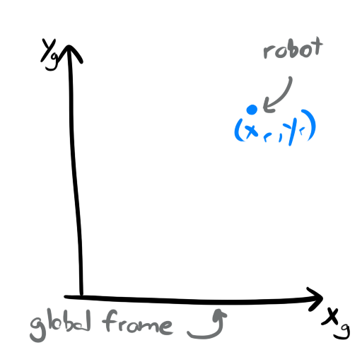

# Differential-Drive-Robot-Motion
A MATLAB Script for simulating a simple wheeled mobile robot in a 2D environment and exploring kinematic models used for dead reckoning position tracking.

## Motion Models for Differential Drive Mobile Robots
In any mobile robotics project knowing how to estimate your robot's position is fundamental for any application. Determining where your robot is within its environment requires some kind of model to estimate its position based on control inputs to the robot. Most commonly, we use the robot's linear velocity and rotational velocity as the inputs to the kinematic models. These velocities can come from a variety of sources, such as commanded velocities to the robot, inertial measurement units, or wheel encoders.

For this application, we'll consider one of the most common scenarios: tracking the 2D pose of a differential drive robot using wheel encoders.

## The Basics

Before jumping into the code, let's take a moment to define some terms and give some basic background information you have probably seen before. But for the sake of completion and for readers who may be encountering this information for the first time, I will be rehashing the fundamentals here.

The first thing to define is the "global frame" or the "world frame". This is the coordinate system used to define the environment in which the robot exists. For this project we are considering a 2D robot, so it will exist in a 2D x,y global coordinate system.

We will define the 2D pose of the robot as the following:

The pose of the robot corresponds to its x,y position and theta orientation within the global frame. The robot is modeled as a single point with some orientation.

The control input for the robot will be derived from its wheel enocders. The wheel encoders measure the rotations of the robot's wheels, which can be used to determine the velocity of each wheel. Typically, this value is produced in radians per second. We will want to transform this value so we get meters per secod for each wheel:

Where d is the wheel diameter. This equation gives us the wheel velocity in mps. This will need to be performed for each tire of the robot.

Once we have the linear velocity of the left and right wheel, we then need to consider the dynamics of a differential drive system to determine its linear and rotational velocity of the overall vehicle. For example, if both wheels are moving forward at the same velocity, the vehicle itself will only have a linear velocity directed along the robot's local coordinate frame's x axis. If each wheel moves at equal velocities in opposite directions, the robot will have a rotational velocity and no linear velocity as it will be moving in place. If the robot moves with both wheels with different, positive velocities, the robot will move with some curvature, resulting in a linear and rotational velocity.

To compute linear and rotational velocities, the following equations are used:

and 

where  and  are the right and left wheel velocities, respectively, and W is the track width of the robot. Trackwidth is the distance between each wheel. The point that defines the origin of the robot frame is the point halfway between each wheel. 

## The Linear Forward Kinematic Model

To determine our robot's position after getting the linear and rotational velocities of the robot, we need a mathematical model representing the kinematics of the differential drive system. This model will allow us to input the velocities and the amount of time between readings to determine the robot's change in position. The simplest model for the kinematics of a differential drive robot is a linear model that simply performs the linear translation and rotation afterwards. This model begins by creating a rotation matrix based on the robot's current orientation.

Where theta is the robot's current orientation. We will multiply this matrix by a vector containing our linear and rotational velocities.

By multiplying R by u, we get a 3x1 vector contining the x and y linear velocities in the world frame and the rotational velocities of the robot. 

by multiplying these by the change in time between iterations, , and adding it to the original pose, we get the updated pose of the robot.

## The ICR Forward Kinematic Model

While the linear model is simple, and when used at a very high sampling rate, it provides a "good enough" estimation of the robot's position. However, this model does not account for the curvature of the robot's motion as it only performs a linear motion THEN rotates. In reality, the robot is turning while making its linear motion. The model introduced here will account for this and provide a more accurate estimation of the robot's pose (assuming constant velocity).

If the robot is driving at a constant linear and rotational velocity, that motion can be described as a circle with some radius. The equation for an arbitrary objection moving on a circular trajector with radius r can be described by:

Rearranged, we get::

Where v and omega are the robot's linear and rotational velocities. This gives us the radius of the circle described by the robot's motion. The point in the center of this circle is called the instantaneous center of rotation. "Instantaneous" as we are only considering the velocity of the robot at that current moment. The equations to find the x,y point that is the center of rotation are as follows:

Where xc and yc is the center point of the circle described by the robot's motion. The following equation computes the arclength of the robot's motion along the circle to find the new pose of the robot after delta t seconds of travel:

Which after substituting for xc and yc:

This equation gives us the robot's new pose while considering the curvature of the motion. However, this model has one caveat: pure linear motion. If the robot is driving on a straight line, the circle describing it's motion has an infinite radius. So we need to add a conditional statement to handle this. If the robot's angular velocity is sufficently small, then we will assume it is following a straight line and we will use the following model:

Where we simply compute the linear motion of the robot and divide it into x and y components based on the robot's final orientation.

## MATLAB Code Demo

The project code demonstrates the two models mentioned above with a very simple robot simulation. To run the code, simply clone this repository and run the script SIMULATION_RobotMotion.m. This code will drive a simulated robot along a sinusoidal path using the ICR model by default.

<!--- Note: + signs do not show up, so %2B must be used to replace them. https://gist.github.com/a-rodin/fef3f543412d6e1ec5b6cf55bf197d7b -->